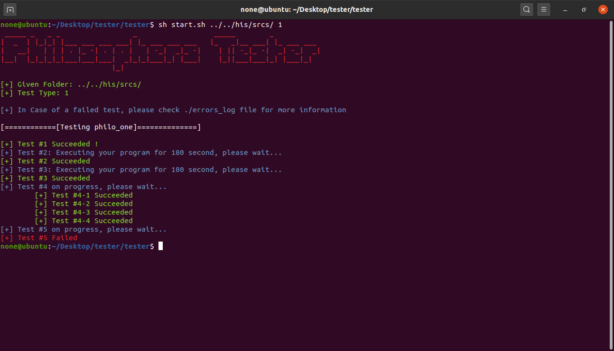

# Philosophers Project Tester

A script to test your Philosopher Project programs, philo_one, philo_two and philo_three.

it only tests your programs by giving them specific arguments, and it doesn't check protection against scrambled output etc... 

## Preview



## Usage

```bash
Usage: start.sh <Project Folder> <Test Type>
	Type 0: test philo_one, philo_two and philo_three
	Type 1: test philo_one only
	Type 2: test philo_two only
	Type 3: test philo_three only
```
